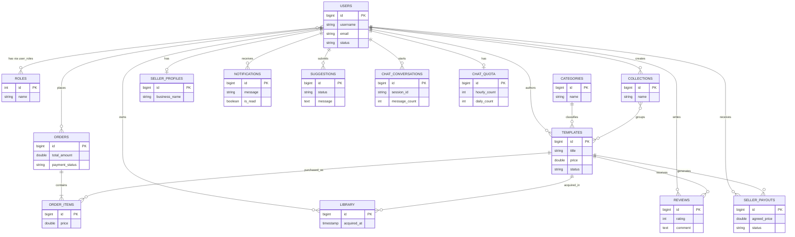

# PandaDocs Backend

Sanitized public portfolio snapshot of a Spring Boot backend for a document-template marketplace.

## Project Snapshot

PandaDocs Backend is a Java/Spring Boot service for a template marketplace with:

- JWT and Google OAuth2 authentication
- role-based flows for `USER`, `SELLER`, and `ADMIN`
- PostgreSQL persistence with Spring Data JPA
- Firebase Storage for template files, avatars, and preview images
- PayOS integration for paid checkout
- Gemini-powered AI chat for template discovery

This repository is a **public-safe snapshot** of a past university project. It is shared to demonstrate backend design, domain modeling, security/authentication flows, third-party integrations, and documentation quality. The frontend is a separate application and is not included here.

Original project period: approximately **October 2025 to November 2025**, based on the feature-branch and default-branch activity visible in the original private repository history.

## For Interviewers / Recruiters

- This is a **past academic project**, not an actively maintained production system.
- The repo was published as a **sanitized portfolio snapshot** after removing sensitive artifacts and private deployment context.
- It is intended to show backend engineering ability: Spring Boot architecture, REST API design, auth, payments, cloud storage, and AI-assisted product search.
- Known limitations are intentionally preserved and documented rather than hidden.

## Current Availability

- The original Google Cloud project used during development has been retired and is no longer running.
- There is no live public demo or active production endpoint attached to this repository.
- The checked-in deployment files are kept as historical implementation evidence, not as proof of a currently operating environment.
- This repo should be reviewed primarily as a backend codebase and system-design artifact.

## Tech Stack

- Java 17
- Spring Boot 3
- Spring Web, Security, Validation, Data JPA
- PostgreSQL
- Firebase Admin SDK / Google Cloud Storage
- PayOS Java SDK
- OkHttp + Gson
- Swagger / OpenAPI
- Docker

## Key Features

- User authentication with username/password and Google OAuth2
- Marketplace flows for browsing, purchasing, and downloading templates
- Seller registration, template upload, and seller dashboard data
- Admin moderation and operational dashboard flows
- AI chat assistant with template-search-first recommendation logic
- File storage and preview handling via Firebase Storage

## Architecture Summary

The backend follows a standard layered Spring structure:

- `src/main/java/com/pandadocs/api/controller`: REST endpoints
- `src/main/java/com/pandadocs/api/service`: business logic and integrations
- `src/main/java/com/pandadocs/api/repository`: JPA repositories
- `src/main/java/com/pandadocs/api/model`: domain entities and enums
- `src/main/java/com/pandadocs/api/dto`: request/response models
- `src/main/java/com/pandadocs/api/security`: JWT, OAuth2, and access control

For a deeper technical review, see [PROJECT_REPORT.md](./PROJECT_REPORT.md).

## Database Overview



This is a simplified conceptual ERD for understanding the marketplace domain. The public repo does not include a full checked-in migration history for the whole schema, so treat this as a domain map rather than exact DDL. See [database/README.md](./database/README.md) for the current migration note.

## Local Review / Best-Effort Startup

1. Install Java 17, Maven, and PostgreSQL.
2. Run the local bootstrap script:

```powershell
.\scripts\bootstrap-local.ps1
```

3. Put your Firebase service-account JSON in the ignored `secrets/` folder or supply credentials through environment variables.
4. Edit `src/main/resources/application-local.properties` with your local values.
5. Review the full setup guide at [docs/setup.md](./docs/setup.md).
6. Attempt to start the application with the local profile:

```bash
./mvnw spring-boot:run -Dspring-boot.run.profiles=local
```

7. Open Swagger UI after startup:

```text
http://localhost:8080/swagger-ui.html
```

If you do not want a local profile file, you can instead provide the same values through shell environment variables. [.env.example](./.env.example) is the reference list, not an auto-loaded file.

Successful local startup is **not guaranteed** in this public snapshot. The original cloud project has been deleted, the full marketplace database bootstrap is not included, and some third-party integrations require recreating private infrastructure manually.

## Documentation

- [docs/README.md](./docs/README.md): documentation index
- [docs/setup.md](./docs/setup.md): step-by-step local setup
- [PROJECT_REPORT.md](./PROJECT_REPORT.md): bilingual project report
- [docs/ai-chat/frontend-integration.md](./docs/ai-chat/frontend-integration.md): AI chat frontend contract

## Local Secrets Workflow

- Public repo: tracked files contain placeholders only
- Local machine: keep real secrets in `src/main/resources/application-local.properties`, shell env vars, or the ignored `secrets/` folder
- Cloud deployment: keep real secrets in Secret Manager or deployment environment variables
- Before pushing publicly, run:

```powershell
.\scripts\preflight-public-check.ps1
```

## Limitations

- This is a backend-only repo; the frontend is separate.
- The original cloud deployment was deleted after the project period, so there is no live hosted instance.
- Database bootstrap is not fully automated in this public snapshot.
- Some legacy docs are preserved for context and may reflect historical implementation state.
- Test coverage is limited and the repo is presented primarily for architecture/code review, not as a finished production deployment.

## Repository Status

This repo should be treated as a **portfolio snapshot**:

- stable enough to review
- no longer backed by the original paid cloud environment
- not guaranteed to receive ongoing feature development
- intentionally public-safe rather than infrastructure-complete

## Security Note

The original private project contained deployment-specific values and sensitive artifacts. This public version removes those files and replaces deployable examples with placeholders. Before publishing your own fork, verify that:

- no real credentials are tracked
- no backup config files remain
- no secret previews are logged
- deployment manifests use placeholders or environment-driven values only
- if any real secrets were ever committed in private history, rotate them outside this repository before publishing related code
